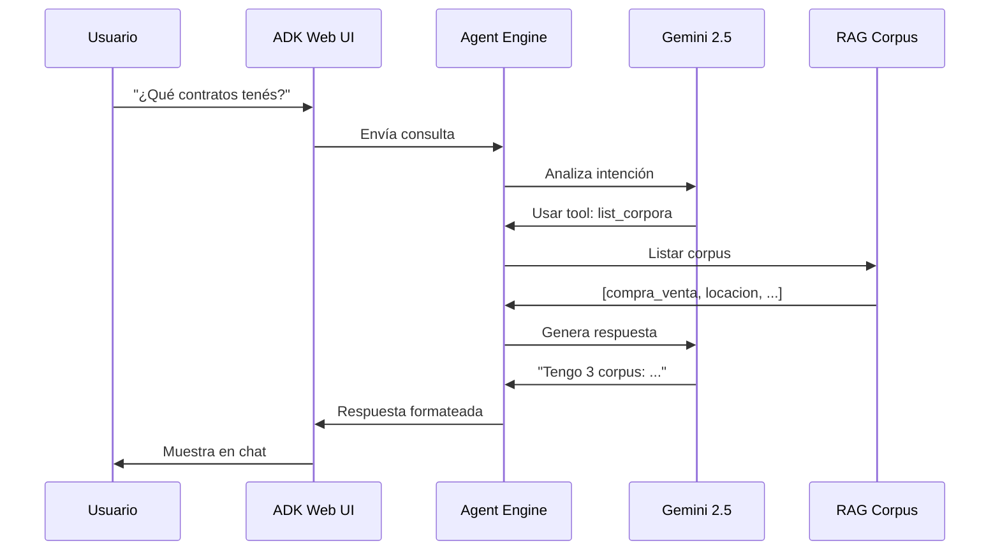

# Arquitectura del Sistema RAG Legal Agent

Esta guía explica **cómo funciona** el sistema completo, de manera clara y educativa.

## 🎯 Visión General

El sistema está compuesto por **3 capas principales**:

```
┌────────────────────────────────────────────────────────────┐
│                    CAPA DE PRESENTACIÓN                    │
│  (Lo que ve el usuario)                                    │
│                                                            │
│  ┌──────────────────────────────────────────────────┐    │
│  │  ADK Web UI (Cloud Run)                          │    │
│  │  - Interfaz de chat                              │    │
│  │  - Autenticación Google                          │    │
│  │  - Historial de conversaciones                   │    │
│  └──────────────────────────────────────────────────┘    │
└─────────────────────┬──────────────────────────────────────┘
                      │ API REST
                      ↓
┌────────────────────────────────────────────────────────────┐
│                    CAPA DE LÓGICA                          │
│  (El cerebro del sistema)                                  │
│                                                            │
│  ┌──────────────────────────────────────────────────┐    │
│  │  RAG Agent (Vertex AI Agent Engine)              │    │
│  │  - Procesa consultas                             │    │
│  │  - Ejecuta herramientas                          │    │
│  │  - Genera respuestas con Gemini 2.5             │    │
│  └──────────────────────────────────────────────────┘    │
└─────────────────────┬──────────────────────────────────────┘
                      │ Vertex AI API
                      ↓
┌────────────────────────────────────────────────────────────┐
│                    CAPA DE DATOS                           │
│  (Donde se almacena la información)                        │
│                                                            │
│  ┌──────────────────────────────────────────────────┐    │
│  │  Vertex AI RAG                                    │    │
│  │  - Corpus de documentos                          │    │
│  │  - Embeddings vectoriales                        │    │
│  │  - Búsqueda semántica                            │    │
│  └──────────────────────────────────────────────────┘    │
└────────────────────────────────────────────────────────────┘
```

## 🔍 Flujo de una Consulta (Paso a Paso)

Cuando un usuario hace una pregunta, esto es lo que pasa:

### Paso 1: Usuario hace una pregunta

```
Usuario escribe en el chat: "¿Qué documentos de compra-venta tenés?"
```

### Paso 2: ADK Web UI procesa la entrada

```javascript
// La UI envía la consulta al backend
POST /api/chat/message
{
  "user_id": "123abc",
  "session_id": "session_456",
  "message": "¿Qué documentos de compra-venta tenés?"
}
```

### Paso 3: Agent Engine recibe la consulta

El agente:
1. Carga su configuración (instrucciones, herramientas disponibles)
2. Analiza la pregunta con Gemini 2.5 Flash
3. Decide qué herramienta usar

### Paso 4: El agente usa herramientas

En este caso, usa `list_corpora`:

```python
# El agente ejecuta esta función
def list_corpora():
    # Conecta con Vertex AI RAG
    corpora = rag.list_corpora()
    # Devuelve la lista
    return corpora
```

### Paso 5: RAG busca en los documentos

Si el agente necesita información de documentos, usa `rag_query`:

```python
def rag_query(corpus_name, query):
    # 1. Convierte la pregunta en un vector (embedding)
    embedding = embedding_model.encode(query)

    # 2. Busca documentos similares
    results = corpus.search(embedding, top_k=3)

    # 3. Devuelve los chunks relevantes
    return results
```

### Paso 6: Gemini genera la respuesta

```
Gemini 2.5 Flash recibe:
- Pregunta original
- Información encontrada en documentos
- Instrucciones del agente (hablar en español, ser formal, etc.)

→ Genera respuesta coherente
```

### Paso 7: Respuesta llega al usuario

```
"Tengo disponibles 3 corpus de documentos:
1. compra_venta - Contratos de compra-venta
2. locacion - Contratos de locación
3. poderes - Poderes legales
¿Sobre cuál querés consultar?"
```

## 🧩 Componentes en Detalle

### 1. ADK Web UI (Cloud Run)

**¿Qué es?**
- Interfaz web desarrollada por Google
- Corre en un container Docker
- Hospedada en Cloud Run (serverless)

**¿Qué hace?**
- Muestra el chat para los usuarios
- Autentica usuarios con Google
- Mantiene el historial de conversaciones
- Envía/recibe mensajes del agente

**Tecnologías:**
- FastAPI (servidor web Python)
- WebSockets (comunicación en tiempo real)
- Angular (frontend - parte de ADK Web)

**Puerto:** 8080

**URL:** https://rag-legal-agent-ui-997298514042.us-central1.run.app

### 2. RAG Agent (Vertex AI Agent Engine)

**¿Qué es?**
- Tu agente personalizado ejecutándose en la nube
- Usa el framework ADK (Agent Development Kit)
- Configurado para análisis legal en español

**¿Qué hace?**
- Recibe consultas de usuarios
- Decide qué herramientas usar
- Ejecuta búsquedas en documentos
- Genera respuestas con IA

**Configuración:**

```python
Agent(
    name="RagAgent",
    model="gemini-2.5-flash",  # Modelo de IA
    description="Vertex AI RAG Agent",
    tools=[                     # 7 herramientas
        rag_query,
        list_corpora,
        create_corpus,
        add_data,
        get_corpus_info,
        delete_corpus,
        delete_document,
    ],
    instruction="..."          # Comportamiento del agente
)
```

**Herramientas disponibles:**

| Herramienta | Función |
|------------|---------|
| `rag_query` | Buscar información en documentos |
| `list_corpora` | Listar corpus disponibles |
| `create_corpus` | Crear nuevo corpus |
| `add_data` | Agregar documentos a un corpus |
| `get_corpus_info` | Obtener info de un corpus |
| `delete_document` | Eliminar documento |
| `delete_corpus` | Eliminar corpus completo |

### 3. Vertex AI RAG (Almacenamiento)

**¿Qué es?**
- Servicio de Google para Retrieval Augmented Generation
- Almacena documentos y sus embeddings
- Hace búsquedas semánticas ultra-rápidas

**¿Cómo funciona?**

```
Documento Original:
"Juan Pérez vende su casa en Calle Falsa 123 por $100,000"

↓ Procesamiento

Chunks (pedazos):
1. "Juan Pérez vende su casa"
2. "casa en Calle Falsa 123"
3. "vende por $100,000"

↓ Embedding (vectorización)

Vectores numéricos:
[0.234, -0.123, 0.456, ...]
[0.111, 0.333, -0.234, ...]
[0.789, -0.456, 0.123, ...]

↓ Almacenamiento

Base de datos vectorial
(búsquedas semánticas en milisegundos)
```

**Configuración de embeddings:**

```python
DEFAULT_CHUNK_SIZE = 512           # Tamaño de cada pedazo
DEFAULT_CHUNK_OVERLAP = 100        # Superposición entre chunks
DEFAULT_TOP_K = 3                  # Resultados a devolver
DEFAULT_EMBEDDING_MODEL = "text-embedding-005"
```

## 🔐 Seguridad y Autenticación

### Autenticación de Usuarios

```
Usuario intenta acceder
      ↓
Google OAuth verifica identidad
      ↓
¿Email autorizado en IAM?
      ↓ Sí              ↓ No
Acceso permitido    403 Forbidden
```

**IAM Policy actual:**

```yaml
roles/run.invoker:
  - user:carlos@xplorers.ar
  - user:escribania@mastropasqua.ar
  - user:escribaniamastropasqua@gmail.com
  - user:camib.milone@gmail.com
```

### Autenticación del Agente

```
Cloud Run (UI)
      ↓ Service Account
Vertex AI Agent Engine
      ↓ Service Account
Vertex AI RAG
```

**Service Account usado:**
`997298514042-compute@developer.gserviceaccount.com`

## 📊 Flujo de Datos Completo



## 💾 Estado y Sesiones

**¿Cómo se mantiene el contexto de la conversación?**

```python
session = {
    'id': '7489239339956699136',
    'user_id': 'carlos@xplorers.ar',
    'events': [
        {'role': 'user', 'content': '¿Qué corpus tenés?'},
        {'role': 'agent', 'content': 'Tengo 3 corpus...'},
        {'role': 'user', 'content': 'Consultá en compra_venta'},
        # ... historial completo
    ],
    'state': {
        'current_corpus': 'compra_venta',
        'last_query_time': '2025-10-10T16:00:00'
    }
}
```

**Almacenamiento:**
- Agent Engine mantiene las sesiones automáticamente
- Se preservan entre llamadas
- Cada usuario tiene su propia sesión

## 🔄 Ciclo de Vida del Sistema

### Startup (Inicio)

```
1. Cloud Run inicia container
2. FastAPI carga el servidor
3. ADK Web UI se conecta al Agent Engine
4. Sistema listo para recibir usuarios
```

### Runtime (Ejecución)

```
Usuario conecta → Crea sesión → Chat interactivo
                                      ↓
                              Consultas al agente
                                      ↓
                              Búsquedas en RAG
                                      ↓
                              Respuestas generadas
```

### Scaling (Escalamiento)

```
1 usuario  → 1 instancia Cloud Run
50 usuarios → 2 instancias (auto-scaling)
0 usuarios → 0 instancias (scale to zero)
```

## 🎓 Conceptos Técnicos Explicados

### ¿Qué es un Embedding?

Un embedding es una **representación numérica** de texto:

```
Texto: "contrato de compra-venta"
Embedding: [0.234, -0.123, 0.456, 0.789, ...]
           (vector de 768 dimensiones)
```

**¿Por qué son útiles?**
- Textos similares tienen embeddings similares
- Permite búsqueda semántica (por significado, no por palabras exactas)

### ¿Qué es un Corpus?

Un **corpus** es una colección organizada de documentos:

```
corpus: compra_venta/
  ├── contrato_1.pdf
  ├── contrato_2.docx
  ├── template_cv.pdf
  └── ejemplo_escritura.pdf
```

### ¿Qué es Serverless?

**Serverless** significa que:
- No administrás servidores
- Solo pagás cuando hay uso
- Escala automáticamente
- Google gestiona la infraestructura

**Ejemplo:**
```
Usuario 1 conecta → Google crea 1 instancia
Usuario 2 conecta → Misma instancia (si hay capacidad)
50 usuarios → Google crea más instancias automáticamente
0 usuarios → Google apaga todo (costo = $0)
```

## 📐 Consideraciones de Diseño

### ¿Por qué Agent Engine y no un servidor tradicional?

**Agent Engine:**
- ✅ Escala automáticamente
- ✅ Manejo de estado incorporado
- ✅ Integración nativa con Vertex AI
- ✅ Pago por uso
- ❌ Menos control bajo nivel

**Servidor Tradicional:**
- ✅ Control total
- ✅ Personalización ilimitada
- ❌ Debes gestionar escalamiento
- ❌ Debes gestionar estado
- ❌ Costo fijo (siempre corriendo)

### ¿Por qué Cloud Run para la UI?

- Serverless (escala automático)
- Soporta WebSockets (para chat en tiempo real)
- Integración fácil con IAM (autenticación Google)
- Deployment simple

## 🔮 Próximos Pasos

Para entender más:

1. **[Servicios de GCP](06-SERVICIOS-GCP.md)** - Detalles de cada servicio usado
2. **[Despliegue del Agente](02-DESPLIEGUE-AGENTE.md)** - Cómo se desplegó todo
3. **[Administración](05-ADMINISTRACION.md)** - Cómo gestionar el sistema

---

**Última actualización**: 2025-10-10
